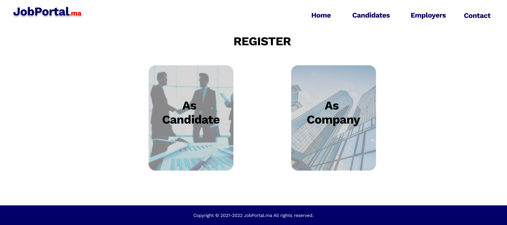

# JobMa
-----------
Worked with a team on a school project to build a website for job seekers and recruiters in the IT domain with many features and functionnalities like the ability to create a resume using the built in feature or to apply directly to the jobs from the app.
-----------

## Features :
- Create Account as recruiter or job seeker  
- Navigate through job posts and profiles  
- Create or upload resume  
- Manage job applications  
- Recieve notifications about the posts  

## Screenshots of the app design :
- Registration page :  
  
- User can chose to regitser either as Job seeker or Recruiter :  
  
- Create candidate account :  
  
- Create company account :  
  

